# Sofian Ecosystem - Architecture Niveau 0

> [!abstract] Rôle
> Cette carte représente **la vie réelle de Sofian avant les systèmes numériques**.
>
> Elle sert à vérifier que rien d'important n'est oublié avant de décider quels systèmes, outils ou agents doivent soutenir chaque domaine.

> [!success] État
> **Base de travail Niveau 0 validée par Sofian le 20 août 2026.**
> Elle ne crée aucune nouvelle Area, aucun nouvel OS et ne déplace aucune donnée.

---

## Carte De Vie

```mermaid
flowchart TB
    S["SOFIAN<br/>vie entière · valeurs · arbitrages"]

    subgraph P["SOI ET LIENS"]
        direction LR
        H["Santé & équilibre<br/>soins · énergie · TDAH · routines"]
        R["Famille & relations<br/>proches · soutien · engagements"]
        L["Logement & cadre de vie<br/>foyer · quotidien · mobilité"]
    end

    subgraph C["DÉVELOPPEMENT ET CONTRIBUTION"]
        direction LR
        E["Études & apprentissage<br/>Epitech · compétences · exploration"]
        W["Carrière, travail & entreprise<br/>emploi · alternance · freelance · clients"]
        K["Création & expression<br/>Køya · musique · design · projets créatifs"]
    end

    subgraph M["SÉCURITÉ ET ENVIRONNEMENT"]
        direction LR
        F["Finances personnelles<br/>comptes · budget · dettes · patrimoine"]
        D["Droits, identité & protections<br/>administrations · fiscalité · assurances"]
        N["Environnement numérique & fabrication<br/>données · appareils · homelab · impression 3D"]
    end

    S --> H
    S --> R
    S --> L
    S --> E
    S --> W
    S --> K
    S --> F
    S --> D
    S --> N

    classDef human fill:#fff3bf,color:#111827,stroke:#f59e0b,stroke-width:3px
    classDef person fill:#ffe3e3,color:#111827,stroke:#e03131,stroke-width:2px
    classDef contribution fill:#dbe4ff,color:#111827,stroke:#3b5bdb,stroke-width:2px
    classDef security fill:#d3f9d8,color:#111827,stroke:#2b8a3e,stroke-width:2px

    class S human
    class H,R,L person
    class E,W,K contribution
    class F,D,N security
```



**Lecture :** la carte part de Sofian, puis regroupe neuf responsabilités durables en trois familles lisibles. Les regroupements facilitent la lecture ; ils ne créent pas de hiérarchie entre les domaines.

---

## Frontières Simples

- Un **domaine de vie** est une responsabilité durable : il continue d'exister même sans projet actif.
- Un **projet** est temporaire et peut traverser plusieurs domaines.
- Une **capacité transverse** — organiser, documenter, décider, communiquer — sert plusieurs domaines sans devenir un domaine supplémentaire.
- Un **système ou outil** sera cartographié plus tard ; il ne définit pas la vie qu'il sert.

---

## Registre Des Domaines

| Domaine | Responsabilité durable | Preuves directes actuelles | Modélisation actuelle |
|---|---|---|---|
| **Santé & équilibre** | Préserver le fonctionnement physique, mental et quotidien | Vision V2, dossier `10-Perso/Sante`, ressources historiques TDAH et routines | Confirmé, peu représenté dans V4 |
| **Famille & relations** | Entretenir les liens et assumer les engagements envers les proches | `10-Perso/Famille`, documents et dossiers familiaux actifs | Confirmé, réparti entre fichiers et tâches |
| **Logement & cadre de vie** | Maintenir un foyer sûr et un quotidien viable | `10-Perso/Logement`, contrats et justificatifs liés au foyer | Confirmé, peu représenté dans V4 |
| **Études & apprentissage** | Apprendre, valider les parcours et développer les compétences | Area `[[🎓 Epitech]]`, projets, rendus et TaskNotes | Confirmé, fortement modélisé |
| **Carrière, travail & entreprise** | Produire de la valeur et construire des revenus professionnels | CV, alternance, projets freelance, Agence Poulpi, obligations URSSAF | Confirmé, mais fragmenté |
| **Création & expression** | Créer, expérimenter et publier une expression personnelle | Køya, musique, design, motion et projets créatifs historiques | Confirmé, peu représenté dans V4 |
| **Finances personnelles** | Protéger les ressources, arbitrer les dépenses et suivre les engagements | Finance OS, comptes, dette et aspiration d'automatisation | Confirmé, système spécialisé existant |
| **Droits, identité & protections** | Rester reconnu, protégé et conforme face aux institutions | `10-Perso/Identite`, Impots, Assurances, Contrats et démarches sociales | Confirmé, gestion documentaire dispersée |
| **Environnement numérique & fabrication** | Maintenir les outils, données et équipements qui soutiennent la vie et la création | Homelab-OS, dotfiles, appareils, Kobra S1, Wanhao D12 | Confirmé, fortement investi |

> [!note] Nuance importante
> **L'administration est une capacité transverse.** Elle sert la santé, la famille, le logement, le travail ou les finances. Le domaine « Droits, identité & protections » représente l'enjeu de vie ; les formulaires et documents sont le moyen de le gérer.

---

## Scénarios De Contrôle

| Situation réelle | Domaine principal | Domaines secondaires |
|---|---|---|
| Prendre et suivre un rendez-vous médical | Santé & équilibre | Droits & protections si remboursement ou dossier |
| Faire avancer un dossier familial sensible | Famille & relations | Droits & protections · finances selon le cas |
| Trouver une alternance liée à Epitech | Études & apprentissage | Carrière, travail & entreprise |
| Déclarer le chiffre d'affaires à l'URSSAF | Carrière, travail & entreprise | Droits & protections · finances personnelles |
| Préparer une date ou une sortie Køya | Création & expression | Travail & entreprise · finances si rémunération |
| Entretenir une imprimante 3D pour produire une pièce | Environnement numérique & fabrication | Création & expression selon la finalité |

**Règle :** une situation reçoit un domaine principal pour savoir quelle responsabilité pilote ; elle peut conserver plusieurs liens secondaires sans être dupliquée.

---

## Capacités Transverses — Pas Des Domaines

```text
Piloter       → aspirations · projets · tâches · revues · décisions
Conserver     → documents · preuves · connaissances · mémoire
Coordonner    → communication · rendez-vous · échéances · acteurs
Améliorer     → apprentissage · mesure · automatisation progressive
```

La couche suivante est détaillée dans [[Sofian Ecosystem - Capacités Transverses]]. La propriété des faits et les systèmes existants sont ensuite cartographiés dans [[Sofian Ecosystem - Systèmes et Autorité des Faits]].

---

## Décisions Et Non-Décisions

### Confirmé

- Le périmètre de Sofian Ecosystem est **toute la vie de Sofian**.
- Le numérique est un moyen de soutien, pas le périmètre de la carte.
- Un projet peut traverser plusieurs domaines sans créer une copie par domaine.

### Inchangé Pour L'Instant

- Les Areas opérationnelles V4 restent `[[🏠 Perso]]` et `[[🎓 Epitech]]`.
- Aucun « Health OS », « Business OS » ou autre système n'est créé par cette carte.
- Aucun fichier personnel, projet, TaskNote ou document n'est déplacé.

### Différé

- Carte des systèmes qui servent ces domaines.
- Contrats entre Sofian OS, Jarvis OS et les systèmes spécialisés.
- Évolution éventuelle des Areas V4.
- Architecture de mémoire et de connaissances de Jarvis.

Le brouillon technique précédent est conservé dans [[Sofian Ecosystem - Architecture des Systèmes - Brouillon]].

---

## Base De Preuves

- `Documents/00-Inbox/SOFIAN OS V2 Document Reference.docx` — vision de vie globale et priorités historiques.
- `98-Backend/Areas/`, `Projects/`, `Tasks/` et `Aspirations/` — état du vault actif.
- `Documents/10-Perso/` — domaines documentaires et obligations réelles.
- Ancien `Sofian's Vault` — intentions et connaissances historiques à recouper.
- `Homelab-OS/`, Finance OS et projets applicatifs — responsabilités numériques réellement opérées.
- Historique Hermes/OpenCode — pistes secondaires, jamais autorité contre les sources actuelles.

---

## Validation

> [!success] Décision
> Sofian valide cette structure comme **base de travail de Niveau 0** le 20 août 2026.

Cette décision confirme :

1. le périmètre « toute la vie, avec le numérique comme moyen » ;
2. les neuf domaines et leurs trois familles comme structure de départ ;
3. le principe d'un domaine principal avec des liens secondaires pour les situations transverses.

Elle ne valide pas encore une évolution des Areas, de nouveaux OS, la carte des systèmes ni leurs contrats.
