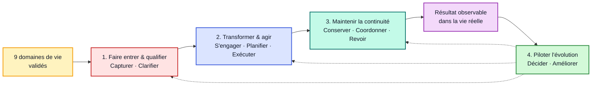

# Sofian Ecosystem - Capacités Transverses

> [!abstract] Rôle
> Cette carte décrit **ce que Sofian doit pouvoir accomplir dans tous ses domaines de vie**, indépendamment des systèmes et des outils.
>
> Elle relie la carte validée [[Sofian Ecosystem - Architecture Niveau 0]] à [[Sofian Ecosystem - Systèmes et Autorité des Faits]], sans confondre capacités et systèmes.

> [!success] État
> **Base de travail validée par Sofian le 20 août 2026.**
> Elle ne crée aucun workflow, aucune Area, aucun OS, aucune automatisation et ne déplace aucune donnée.

---

## Distinction Centrale

```text
Domaine     → où existe la responsabilité durable ?
Capacité    → que faut-il pouvoir accomplir ?
Entité      → sur quels objets métier agit-on ?
Routine     → quand et comment la capacité est-elle exercée ?
Système     → qui possède l'état, les règles et le cycle de vie ?
Outil       → comment le système est-il implémenté aujourd'hui ?
```

Ces cartes peuvent s'aligner sans devenir synonymes. Une capacité ne devient pas automatiquement un workflow, un module, une application, une équipe, un Bot ou un OS.

---

## Carte Synthétique



**Lecture :** les trois premières familles décrivent le flux ordinaire, du signal au résultat réel. La quatrième observe, arbitre et améliore la manière dont le flux fonctionne.

Ce schéma n'est pas une procédure rigide : une situation peut commencer au milieu, revenir en arrière ou ne mobiliser qu'une partie des capacités.

---

## Registre Des Dix Capacités

| Capacité | Outcome distinct | Déclencheur typique | Appui canonique actuel |
|---|---|---|---|
| **1. Capturer** | Ne rien perdre sans décider immédiatement | Idée, message, document, rappel ou événement entrant | V4 `Capture` → `Inbox Item` |
| **2. Clarifier & qualifier** | Donner une destination explicite à une entrée | Capture prête à être traitée | V4 `Clarify` |
| **3. Transformer en engagement** | Passer d'une intention à un résultat et une première action | Aspiration mûre ou résultat nécessitant plusieurs actions | `Aspiration` → `Project` → `Task` |
| **4. Organiser & planifier** | Rendre l'engagement visible au bon moment | Action ou projet à dater, contextualiser ou prioriser | `scheduled_date`, `due_date`, context, priority |
| **5. Exécuter & faire avancer** | Produire un mouvement réel puis fermer ou réorienter | Temps, énergie et contexte disponibles | Engage, Start, Complete, Reschedule |
| **6. Conserver & retrouver** | Préserver une information avec contexte et provenance | Fait, preuve ou savoir à réutiliser | `Resource`, documents, décisions, sources |
| **7. Coordonner & suivre** | Maintenir la continuité entre acteurs, réponses et échéances | Dossier, rendez-vous ou dépendance externe | Tasks, Projects, dates, relations et attentes |
| **8. Revoir & réaligner** | Faire correspondre l'état du système à la réalité | Revue, retard, divergence ou changement de contexte | Daily, Weekly, Project et Aspirations Reviews |
| **9. Décider & gouverner** | Arbitrer priorités, engagements, frontières et règles durables | Conflit, choix structurant ou changement de périmètre | Governance / Intent et décisions humaines |
| **10. Améliorer progressivement** | Réduire une friction prouvée sans déplacer le métier dans l'outil | Pattern répétitif, erreur récurrente ou mesure insuffisante | System first · Tool second · Automation later |

---

## Famille 1 — Faire Entrer Et Qualifier

### 1. Capturer

- **Sortie :** trace brute accessible, sans classification forcée.
- **Invariant :** friction minimale ; aucune Area, priorité ou nature métier obligatoire à l'entrée.
- **Frontière :** Capturer reçoit ; Clarifier décide ensuite.

### 2. Clarifier & Qualifier

- **Sortie :** `Trash`, action immédiate, Resource, Aspiration, Task, Project ou demande de précision.
- **Invariant :** une Task est visible ; un Project a un résultat ; une information n'est pas une action.
- **Frontière :** Clarifier choisit la nature ; Transformer en engagement matérialise ensuite l'engagement.

---

## Famille 2 — Transformer Et Agir

### 3. Transformer En Engagement

- **Sortie :** résultat attendu, Area principale et première action visible.
- **Invariant :** une Aspiration n'est promue que si Sofian s'engage réellement.
- **Frontière :** cette capacité crée l'engagement ; Gouverner décide s'il mérite sa place globale.

### 4. Organiser & Planifier

- **Sortie :** engagement visible selon échéance, date d'apparition, contexte et priorité utiles.
- **Invariant :** `due_date` reste une vraie deadline ; `scheduled_date` n'est pas un faux délai.
- **Frontière :** planifier prépare l'action ; cela ne prouve pas son exécution.

### 5. Exécuter & Faire Avancer

- **Sortie :** action réalisée, bloquée, abandonnée ou replanifiée avec état explicite.
- **Invariant :** commencer une seule action adaptée au temps, à l'énergie et au contexte.
- **Frontière :** une déclaration d'intention n'est pas un résultat réel vérifié.

---

## Famille 3 — Maintenir La Continuité

### 6. Conserver & Retrouver

- **Sortie :** fait, preuve ou savoir retrouvable, daté ou versionné lorsque nécessaire.
- **Invariant :** provenance, autorité et chemin de correction restent identifiables.
- **Frontière :** la mémoire ou une copie agentique ne remplace jamais automatiquement le canon métier.

### 7. Coordonner & Suivre

- **Sortie :** prochain échange, attente, acteur responsable et échéance externe restent visibles jusqu'à l'issue.
- **Invariant :** un message peut créer un engagement ; une attente sans propriétaire n'est pas un suivi.
- **Frontière :** Organiser gère la visibilité temporelle ; Coordonner maintient le fil humain et institutionnel.

### 8. Revoir & Réaligner

- **Sortie :** état corrigé, item fermé ou replanifié, projet doté d'une prochaine action et apprentissage explicite.
- **Invariant :** comparer les représentations à la réalité, pas seulement nettoyer une liste.
- **Frontière :** Revoir fournit les signaux ; Gouverner tranche les arbitrages structurants.

---

## Famille 4 — Piloter L'Évolution

### 9. Décider & Gouverner

- **Sortie :** priorité, engagement, frontière, règle ou refus explicite avec conséquence comprise.
- **Invariant :** Sofian arbitre ; les hypothèses restent distinctes des décisions validées.
- **Frontière :** les décisions locales de Clarify ne deviennent pas toutes des décisions d'architecture.

### 10. Améliorer Progressivement

- **Sortie :** friction mesurée réduite par un petit changement observable et réversible.
- **Invariant :** usage réel avant plateforme ; chemin humain stabilisé avant automatisation.
- **Frontière :** automatiser est une technique possible, pas l'outcome de la capacité.

---

## Scénarios De Contrôle

| Situation réelle | Parcours principal de capacités |
|---|---|
| Rendez-vous médical | Capturer le besoin → Clarifier soin et démarches → Planifier → Coordonner le rendez-vous → Conserver ordonnance ou preuve → Revoir le suivi |
| Dossier familial sensible | Capturer l'événement → Clarifier obligation et acteur → Transformer en engagement → Coordonner les échanges → Conserver les preuves → Revoir jusqu'à résolution |
| Alternance Epitech | Capturer l'offre → Qualifier l'adéquation → Décider de candidater → Planifier et exécuter → Suivre la réponse → Revoir la stratégie |
| Déclaration URSSAF | Capturer l'échéance → Clarifier période et faits autoritaires → Planifier → Exécuter avec contrôle humain → Conserver l'accusé → Rapprocher le paiement réel |
| Date ou sortie Køya | Capturer l'opportunité → Qualifier artistique et commercial → Décider l'engagement → Planifier et coordonner → Conserver contrat et assets → Revoir le résultat |
| Pièce imprimée en 3D | Capturer le besoin → Clarifier la finalité → Transformer en engagement si nécessaire → Planifier et produire en sécurité → Conserver source et paramètres → Examiner le résultat |

Si un scénario ne permet pas d'identifier un outcome, une preuve et une correction, la capacité est trop vague ou la frontière est incomplète.

---

## Invariants Transverses

1. **Arbitrage humain :** Sofian garde la décision sur les engagements et les mutations sensibles.
2. **Autorité explicite :** chaque fait important possède une source canonique et un chemin de correction.
3. **Résultat vérifiable :** une action n'est terminée que lorsque son effet réel est contrôlé.
4. **Faible friction cognitive :** la structure réduit les choix simultanés et n'impose pas de classement prématuré.
5. **Réversibilité proportionnée :** les expérimentations restent petites ; confidentialité, permissions et retour arrière suivent le risque.

---

## Ce Qui N'Est Pas Une Capacité Autonome Pour L'Instant

| Élément | Classification actuelle |
|---|---|
| **Administration** | Application de Clarifier, Planifier, Coordonner et Conserver dans plusieurs domaines |
| **Automatisation** | Technique possible d'Améliorer progressivement, pas une valeur en soi |
| **Mémoire** | Mécanisme de Conserver & retrouver ; elle ne remplace pas les sources métier |
| **Routine** | Manière d'exercer plusieurs capacités dans le temps |
| **Dashboard** | Surface de lecture et de décision, pas capacité métier |
| **Bot / agent** | Acteur ou mécanisme possible ; ne devient pas propriétaire d'une capacité par son nom |
| **Application / OS** | Frontière à décider dans la couche suivante, après validation des capacités |

---

## Principes Du Guide Ultime Appliqués

| Principe | Conséquence ici | Référence |
|---|---|---|
| Superposer plusieurs cartes sans les confondre | Domaines, capacités, systèmes, outils, routines et acteurs restent distincts | Guide, ch. 66 §66.3, p. 376 imprimée / p. 419 PDF |
| Responsabilités avant topologie | Les capacités sont définies avant applications, bases, services ou Bots | Guide, ch. 35 §35.2.2, p. 189 imprimée / p. 232 PDF |
| Une capacité produit un outcome | Chaque capacité possède résultat, déclencheur, frontières et scénarios | Guide, ch. 66 §§66.2–66.4, p. 375–377 / p. 418–420 PDF |
| Un système de référence par fait | Conserver garde provenance, fraîcheur et correction ; les autres représentations restent dérivées | Guide, ch. 46, p. 257–262 / p. 300–305 PDF |
| Incréments observables | La future implémentation devra traverser un scénario réel de bout en bout | Guide, ch. 5, p. 22–25 / p. 65–68 PDF |
| YAGNI et réversibilité | Aucun OS, Bot ou automatisme n'est créé sans usage prouvé | Guide, ch. 6, p. 27–31 / p. 70–74 PDF |
| Contexte comme budget d'attention | Les détails restent récupérables depuis les canons au lieu d'être recopiés partout | Guide, ch. 73 §§73.2–73.6, p. 417–418 / p. 460–461 PDF |

Source locale : `/Users/sofian/Documents/00-Inbox/Guide-ultime-ingenierie-logicielle.pdf`.

---

## Décisions Et Non-Décisions

### Confirmé

- La carte Niveau 0 couvre toute la vie de Sofian avec le numérique comme moyen.
- Les neuf domaines et trois familles constituent la base validée.
- Les quatre familles et les dix capacités, avec leurs noms et leurs frontières, constituent la base validée de la couche Capacités.
- Les quatre familles reprennent les intentions de Niveau 0 : Piloter, Conserver, Coordonner, Améliorer.
- Les Areas V4 restent `[[🏠 Perso]]` et `[[🎓 Epitech]]` pour l'instant.

### Hypothèses Restantes

- `Administration`, `automatisation`, `mémoire`, `routine` et `dashboard` sont correctement classés comme applications, mécanismes ou surfaces.

### Différé

- Systèmes qui fournissent chaque capacité.
- Sources de vérité détaillées et contrats inter-systèmes.
- Niveau d'autonomie de Jarvis pour chaque capacité.
- Évolution éventuelle des Areas et workflows V4.

---

## Validation Enregistrée

Sofian a validé cette carte comme base de travail le **20 août 2026**.

Cette décision valide les quatre familles, les dix capacités, leurs noms et leurs frontières. Elle ne valide pas encore les systèmes qui les fourniront, leurs sources de vérité, leurs contrats ni le niveau d'autonomie de Jarvis.
