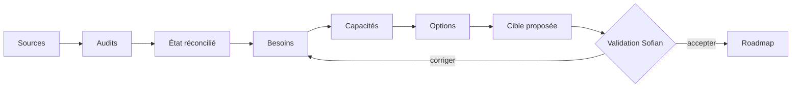

# Sofian Ecosystem

> **État : six audits intégrés, état actuel encore non accepté.** Les sept dossiers système restent `reported` ; aucune cible n’est acceptée.

## Je veux…

### Comprendre ce projet

- [Charte](project/charter.md)
- [Scope complet](project/scope.md)
- [Mode opératoire](project/operating-model.md)
- [Roadmap](project/roadmap.md)

### Auditer une source ou un système

- [Catalogue des audits](audits/catalog.md)
- [Registre des sources](audits/source-registry.md)
- [Modèle de preuve](audits/evidence-model.md)
- [Protocole subagents](operations/subagent-protocol.md)

### Construire la cible

- [Besoins](needs/README.md)
- [Architecture actuelle](architecture/as-is.md)
- [Cibles candidates](architecture/target-candidates.md)
- [Cible acceptée](architecture/target-accepted.md)
- [Transition](architecture/transition.md)

## Progression logique

Lecture : les sources sont auditées avant de décrire l’état ; la cible ne devient réelle qu’après validation de Sofian.
